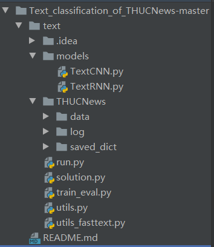

# PyTorch实战LSTM新闻分类
开源项目地址：[https://github.com/ljyljy/Text_classification_of_THUCNews](https://github.com/ljyljy/Text_classification_of_THUCNews)
数据集和代码都在其中，代码含有很多注解，可以跟随Debug看一下代码运行逻辑。
@[toc] 
## 运行
1. 你需要安装tensorboardX，安装方法：你需要先安装tensorboard再安装tensorboardX。因为tensorboard是给tensorflow设计的，pytorch中对应移植过来tensorboardX，而tensorboardX依赖tensorboard。
```python
pip install tensorboard
pip install tensorboardX
```


3. 项目run.py运行项目，输出结果
```python
[(0, ('d', 52)), (1, ('w', 33)), (2, ('b', 20)), (3, ('c', 12))]
Loading data...
Vocab size: 4762
180000it [00:02, 61402.58it/s]
10000it [00:00, 64288.01it/s]
10000it [00:00, 61128.36it/s]
Time usage: 0:00:03
<bound method Module.parameters of Model(
  (embedding): Embedding(4762, 300)
  (lstm): LSTM(300, 128, num_layers=2, batch_first=True, dropout=0.5, bidirectional=True)
  (fc): Linear(in_features=256, out_features=10, bias=True)
)>
Epoch [1/10]
Iter:      0,  Train Loss:   2.3,  Train Acc: 11.72%,  Val Loss:   2.3,  Val Acc: 10.00%,  Time: 0:00:03 *
Iter:    100,  Train Loss:   1.7,  Train Acc: 35.16%,  Val Loss:   1.6,  Val Acc: 39.41%,  Time: 0:00:07 *
Iter:    200,  Train Loss:   1.4,  Train Acc: 51.56%,  Val Loss:   1.2,  Val Acc: 58.01%,  Time: 0:00:11 *
Iter:    300,  Train Loss:  0.78,  Train Acc: 75.00%,  Val Loss:  0.92,  Val Acc: 69.27%,  Time: 0:00:15 *
Iter:    400,  Train Loss:  0.72,  Train Acc: 78.12%,  Val Loss:  0.72,  Val Acc: 77.09%,  Time: 0:00:19 *
Iter:    500,  Train Loss:  0.58,  Train Acc: 82.03%,  Val Loss:  0.65,  Val Acc: 79.57%,  Time: 0:00:23 *
Iter:    600,  Train Loss:   0.6,  Train Acc: 81.25%,  Val Loss:  0.54,  Val Acc: 82.79%,  Time: 0:00:28 *
Iter:    700,  Train Loss:  0.54,  Train Acc: 80.47%,  Val Loss:  0.53,  Val Acc: 83.52%,  Time: 0:00:32 *
Iter:    800,  Train Loss:  0.49,  Train Acc: 86.72%,  Val Loss:  0.51,  Val Acc: 84.34%,  Time: 0:00:36 *
Iter:    900,  Train Loss:  0.49,  Train Acc: 85.94%,  Val Loss:  0.46,  Val Acc: 85.47%,  Time: 0:00:40 *
Iter:   1000,  Train Loss:  0.35,  Train Acc: 89.06%,  Val Loss:  0.46,  Val Acc: 85.51%,  Time: 0:00:44 *
Iter:   1100,  Train Loss:  0.31,  Train Acc: 89.84%,  Val Loss:  0.45,  Val Acc: 85.64%,  Time: 0:00:48 *
Iter:   1200,  Train Loss:  0.33,  Train Acc: 92.19%,  Val Loss:  0.42,  Val Acc: 87.15%,  Time: 0:00:52 *
Iter:   1300,  Train Loss:  0.39,  Train Acc: 84.38%,  Val Loss:  0.43,  Val Acc: 86.52%,  Time: 0:00:56 
Iter:   1400,  Train Loss:  0.47,  Train Acc: 87.50%,  Val Loss:   0.4,  Val Acc: 87.75%,  Time: 0:01:00 *
Epoch [2/10]
Iter:   1500,  Train Loss:  0.41,  Train Acc: 85.16%,  Val Loss:  0.39,  Val Acc: 87.62%,  Time: 0:01:04 *
Iter:   1600,  Train Loss:  0.37,  Train Acc: 85.16%,  Val Loss:  0.41,  Val Acc: 87.37%,  Time: 0:01:08 
Iter:   1700,  Train Loss:   0.4,  Train Acc: 85.16%,  Val Loss:  0.39,  Val Acc: 87.44%,  Time: 0:01:12 *
Iter:   1800,  Train Loss:  0.31,  Train Acc: 90.62%,  Val Loss:  0.38,  Val Acc: 88.18%,  Time: 0:01:16 *
Iter:   1900,  Train Loss:  0.35,  Train Acc: 91.41%,  Val Loss:  0.36,  Val Acc: 88.60%,  Time: 0:01:20 *
Iter:   2000,  Train Loss:   0.4,  Train Acc: 87.50%,  Val Loss:  0.36,  Val Acc: 88.66%,  Time: 0:01:24 
Iter:   2100,  Train Loss:  0.37,  Train Acc: 89.84%,  Val Loss:  0.36,  Val Acc: 88.92%,  Time: 0:01:28 
Iter:   2200,  Train Loss:  0.26,  Train Acc: 90.62%,  Val Loss:  0.35,  Val Acc: 89.06%,  Time: 0:01:32 *
Iter:   2300,  Train Loss:  0.28,  Train Acc: 91.41%,  Val Loss:  0.33,  Val Acc: 89.27%,  Time: 0:01:36 *
Iter:   2400,  Train Loss:  0.27,  Train Acc: 92.19%,  Val Loss:  0.36,  Val Acc: 88.58%,  Time: 0:01:41 
Iter:   2500,  Train Loss:   0.2,  Train Acc: 93.75%,  Val Loss:  0.34,  Val Acc: 89.36%,  Time: 0:01:45 
Iter:   2600,  Train Loss:  0.31,  Train Acc: 92.19%,  Val Loss:  0.35,  Val Acc: 88.94%,  Time: 0:01:49 
Iter:   2700,  Train Loss:   0.3,  Train Acc: 91.41%,  Val Loss:  0.35,  Val Acc: 88.95%,  Time: 0:01:53 
Iter:   2800,  Train Loss:  0.38,  Train Acc: 87.50%,  Val Loss:  0.33,  Val Acc: 89.75%,  Time: 0:01:57 *
Epoch [3/10]
Iter:   2900,  Train Loss:   0.4,  Train Acc: 87.50%,  Val Loss:  0.33,  Val Acc: 89.59%,  Time: 0:02:02 
Iter:   3000,  Train Loss:  0.24,  Train Acc: 93.75%,  Val Loss:  0.33,  Val Acc: 89.74%,  Time: 0:02:06 
Iter:   3100,  Train Loss:  0.22,  Train Acc: 94.53%,  Val Loss:  0.34,  Val Acc: 89.46%,  Time: 0:02:10 
Iter:   3200,  Train Loss:  0.39,  Train Acc: 92.19%,  Val Loss:  0.35,  Val Acc: 89.13%,  Time: 0:02:14 
Iter:   3300,  Train Loss:  0.26,  Train Acc: 92.19%,  Val Loss:  0.32,  Val Acc: 89.96%,  Time: 0:02:17 *
Iter:   3400,  Train Loss:  0.26,  Train Acc: 93.75%,  Val Loss:  0.33,  Val Acc: 89.88%,  Time: 0:02:21 
Iter:   3500,  Train Loss:  0.21,  Train Acc: 92.97%,  Val Loss:  0.33,  Val Acc: 89.50%,  Time: 0:02:25 
Iter:   3600,  Train Loss:  0.19,  Train Acc: 93.75%,  Val Loss:  0.32,  Val Acc: 90.31%,  Time: 0:02:29 *
Iter:   3700,  Train Loss:  0.33,  Train Acc: 91.41%,  Val Loss:  0.31,  Val Acc: 90.19%,  Time: 0:02:33 *
Iter:   3800,  Train Loss:  0.27,  Train Acc: 89.84%,  Val Loss:  0.31,  Val Acc: 90.34%,  Time: 0:02:36 
Iter:   3900,  Train Loss:  0.25,  Train Acc: 92.97%,  Val Loss:  0.32,  Val Acc: 90.17%,  Time: 0:02:40 
Iter:   4000,  Train Loss:  0.21,  Train Acc: 92.97%,  Val Loss:  0.33,  Val Acc: 90.02%,  Time: 0:02:44 
Iter:   4100,  Train Loss:  0.31,  Train Acc: 89.06%,  Val Loss:  0.32,  Val Acc: 90.04%,  Time: 0:02:48 
Iter:   4200,  Train Loss:  0.28,  Train Acc: 89.84%,  Val Loss:  0.31,  Val Acc: 89.92%,  Time: 0:02:52 
Epoch [4/10]
Iter:   4300,  Train Loss:  0.17,  Train Acc: 92.97%,  Val Loss:  0.32,  Val Acc: 89.83%,  Time: 0:02:55 
Iter:   4400,  Train Loss:  0.14,  Train Acc: 96.88%,  Val Loss:  0.31,  Val Acc: 90.48%,  Time: 0:02:59 
Iter:   4500,  Train Loss:  0.26,  Train Acc: 92.19%,  Val Loss:  0.32,  Val Acc: 90.10%,  Time: 0:03:03 
Iter:   4600,  Train Loss:  0.25,  Train Acc: 92.19%,  Val Loss:  0.32,  Val Acc: 90.27%,  Time: 0:03:07 
Iter:   4700,  Train Loss:  0.34,  Train Acc: 89.84%,  Val Loss:   0.3,  Val Acc: 90.40%,  Time: 0:03:11 *
Iter:   4800,  Train Loss:  0.14,  Train Acc: 96.09%,  Val Loss:  0.32,  Val Acc: 90.23%,  Time: 0:03:14 
Iter:   4900,  Train Loss:  0.18,  Train Acc: 92.97%,  Val Loss:   0.3,  Val Acc: 90.58%,  Time: 0:03:18 *
Iter:   5000,  Train Loss:  0.22,  Train Acc: 91.41%,  Val Loss:  0.32,  Val Acc: 90.28%,  Time: 0:03:22 
Iter:   5100,  Train Loss:  0.24,  Train Acc: 90.62%,  Val Loss:   0.3,  Val Acc: 90.85%,  Time: 0:03:26 *
Iter:   5200,  Train Loss:  0.28,  Train Acc: 90.62%,  Val Loss:  0.31,  Val Acc: 90.29%,  Time: 0:03:30 
Iter:   5300,  Train Loss:  0.19,  Train Acc: 93.75%,  Val Loss:  0.32,  Val Acc: 90.17%,  Time: 0:03:34 
Iter:   5400,  Train Loss:  0.33,  Train Acc: 89.06%,  Val Loss:  0.32,  Val Acc: 90.31%,  Time: 0:03:37 
Iter:   5500,  Train Loss:  0.19,  Train Acc: 93.75%,  Val Loss:   0.3,  Val Acc: 90.88%,  Time: 0:03:41 
Iter:   5600,  Train Loss:  0.11,  Train Acc: 95.31%,  Val Loss:   0.3,  Val Acc: 90.60%,  Time: 0:03:45 
Epoch [5/10]
Iter:   5700,  Train Loss:  0.21,  Train Acc: 92.97%,  Val Loss:  0.31,  Val Acc: 90.73%,  Time: 0:03:49 
Iter:   5800,  Train Loss:  0.12,  Train Acc: 96.88%,  Val Loss:  0.32,  Val Acc: 90.22%,  Time: 0:03:53 
Iter:   5900,  Train Loss:  0.14,  Train Acc: 96.09%,  Val Loss:  0.32,  Val Acc: 90.56%,  Time: 0:03:56 
Iter:   6000,  Train Loss:  0.21,  Train Acc: 91.41%,  Val Loss:  0.32,  Val Acc: 90.52%,  Time: 0:04:00 
Iter:   6100,  Train Loss:  0.31,  Train Acc: 91.41%,  Val Loss:   0.3,  Val Acc: 90.65%,  Time: 0:04:04 
No optimization for a long time, auto-stopping...
Test Loss:  0.29,  Test Acc: 90.79%
Precision, Recall and F1-Score...
               precision    recall  f1-score   support

      finance     0.9079    0.8970    0.9024      1000
       realty     0.8844    0.9410    0.9118      1000
       stocks     0.8921    0.8100    0.8491      1000
    education     0.9600    0.9360    0.9478      1000
      science     0.8297    0.8770    0.8527      1000
      society     0.8794    0.9260    0.9021      1000
     politics     0.8963    0.8640    0.8798      1000
       sports     0.9702    0.9760    0.9731      1000
         game     0.9482    0.9150    0.9313      1000
entertainment     0.9186    0.9370    0.9277      1000

     accuracy                         0.9079     10000
    macro avg     0.9087    0.9079    0.9078     10000
 weighted avg     0.9087    0.9079    0.9078     10000

Confusion Matrix...
[[897  25  37   3  15   9  10   2   0   2]
 [  8 941  14   0   7  12   4   2   2  10]
 [ 59  35 810   3  53   0  32   2   4   2]
 [  0   7   2 936   4  22   9   3   4  13]
 [  6  14  17   3 877  18  19   1  28  17]
 [  0  20   1  14   7 926  16   2   2  12]
 [ 10  11  18   8  26  47 864   3   5   8]
 [  1   2   3   0   2   3   4 976   1   8]
 [  2   2   4   1  53   8   2   2 915  11]
 [  5   7   2   7  13   8   4  13   4 937]]
Time usage: 0:00:01

Process finished with exit code 0

```
3. 使用tensorboard查看
切换到TextRNN文件夹下运行

```python
cd THUCNews\log\TextRNN
tensorboard --logdir=10-19_10.48
```
在浏览器输入运行后输出的地址


## 数据输入解读
- 处理步骤
1. 数据预处理，分词，固定输入长度，输入长度不够则进行0填充
2. embedding词嵌入，把分词到“大表”中寻找对应的词向量（默认300维）
3. 输入维度（batch_size一次处理多少标题，max_L最大训练长度，feature_size每个词的维度（默认300维））
## 项目代码解读
- 项目整体结构

- 接下来我们Debug run.py文件
- 我用的IDE是Pycharm，F7单步调试且进入函数，F8不进入函数，Shift+F8跳出函数

```python
if __name__ == '__main__':
    dataset = 'THUCNews'  # 数据集
```
搜狗新闻:embedding_SougouNews.npz, 腾讯:embedding_Tencent.npz, 随机初始化:random，如果训练的不是特殊领域如癌细胞研究等专有名词特别多，可以使用公开的embedding词嵌入表
```python
    embedding = 'embedding_SougouNews.npz'
    if args.embedding == 'random':
        embedding = 'random'
    model_name = args.model  #TextCNN, TextRNN,
    # 导入数据预处理与加载函数
    if model_name == 'FastText':  # 如果所选模型名字为FastText 由于增加了bi-gram tri-gram特征 会有不同的行为
        from utils_fasttext import build_dataset, build_iterator, get_time_dif
        embedding = 'random'  # 此时embedding需要设置为随机初始化
    else:  # 其他模型统一处理
        from utils import build_dataset, build_iterator, get_time_dif
    x = import_module('models.' + model_name)  # 根据所选模型名字在models包下 获取相应模块(.py)
    config = x.Config(dataset, embedding)  # 每一个模块(.py)中都有一个模型定义类 和与该模型相关的配置类(定义该模型的超参数) 初始化配置类的对象
```
F7进入Config，配置文件我们默认是TextRNN，在此文件配置好需要的参数，超参数，路径

```python
class Config(object):
    """配置参数"""
    # ↓ dataset = 'THUCNews'  # 数据集
    def __init__(self, dataset, embedding):
        self.model_name = 'TextRNN'
        self.train_path = dataset + '/data/train.txt'                                # 训练集
        self.dev_path = dataset + '/data/dev.txt'                                    # 验证集
        self.test_path = dataset + '/data/test.txt'                                  # 测试集
        self.class_list = [x.strip() for x in open(
            dataset + '/data/class.txt').readlines()]                                # 类别名单
        self.vocab_path = dataset + '/data/vocab.pkl'                                # 词表，词以及对应的索引
        self.save_path = dataset + '/saved_dict/' + self.model_name + '.ckpt'        # 模型训练结果保存
        self.log_path = dataset + '/log/' + self.model_name  # 模型中间训练，方便进行可视化展示
        self.embedding_pretrained = torch.tensor(
            np.load(dataset + '/data/' + embedding)["embeddings"].astype('float32'))\
            if embedding != 'random' else None                                       # 预训练词向量
        self.device = torch.device('cuda' if torch.cuda.is_available() else 'cpu')   # 设备
        self.dropout = 0.5                                              # 随机失活
        self.require_improvement = 1000                                 # 若超过1000batch效果还没提升（loss没有下降），则提前结束训练
        self.num_classes = len(self.class_list)                         # 类别数
        self.n_vocab = 0                                                # 词表大小，在运行时赋值
        self.num_epochs = 10                                            # epoch数
        self.batch_size = 128                                           # mini-batch大小
        self.pad_size = 32                                              # 每句话处理成的长度(短填长切)多退少补0
        self.learning_rate = 1e-3                                       # 学习率
        self.embed = self.embedding_pretrained.size(1)\
            if self.embedding_pretrained is not None else 300           # 字向量维度, 若使用了预训练词向量，则维度统一
        self.hidden_size = 128                                          # lstm隐藏层
        self.num_layers = 2                                             # lstm层数
```
shift+F8跳出配置文件，设置随机种子 确保每次运行的条件(模型参数初始化、数据集的切分或打乱等)是一样的，方便我们调节网络，看到网络效果，而不是因为这些随机的原因。
```python
    np.random.seed(1)
    torch.manual_seed(1)
    torch.cuda.manual_seed_all(1)
    torch.backends.cudnn.deterministic = True  # 保证每次结果一样
```
读取数据，F7进入build_dataset

```python
    start_time = time.time()
    print("Loading data...")
    vocab, train_data, dev_data, test_data = build_dataset(config, args.word)
    train_iter = build_iterator(train_data, config)
    dev_iter = build_iterator(dev_data, config)
    test_iter = build_iterator(test_data, config)
    time_dif = get_time_dif(start_time)
    print("Time usage:", time_dif)
```
构建当前文本语料表（基于字或者基于词）要与embedding一致，字要容易一些因为词可能达到上万
```python
def build_dataset(config, ues_word):
    # 定义tokenizer函数（word-level/character-level）
    if ues_word:  # 基于词 提前用分词工具把文本分开 以空格为间隔
        tokenizer = lambda x: x.split(' ')  # 直接以空格分开 word-level
    else:  # 基于字符  <--本项目中没有结合词组，只是单词级别，∴数据集小，训练快
        tokenizer = lambda x: [y for y in x]  # char-level

    # 构建词/字典
    if os.path.exists(config.vocab_path):  # 如果存在构建好的词/字典 则加载
        vocab = pkl.load(open(config.vocab_path, 'rb'))
    else:  # 构建词/字典（基于训练集）
        vocab = build_vocab(config.train_path, tokenizer=tokenizer, max_size=MAX_VOCAB_SIZE, min_freq=1)
        # 保存构建好的词/字典
        pkl.dump(vocab, open(config.vocab_path, 'wb'))
    # 词/字典大小
    print(f"Vocab size: {len(vocab)}")
```
读取数据

```python
    def load_dataset(path, pad_size=32):
        contents = []
        with open(path, 'r', encoding='UTF-8') as f:
            for line in tqdm(f):  # 遍历每一行  # tqdm：进度条显示
                lin = line.strip()  # 去掉首尾空白符
                if not lin:  # 遇到空行 跳过
                    continue
                content, label = lin.split('\t')  # text  label；每一行以\t为切分
                words_line = []
                token = tokenizer(content)  # 对文本进行分词/分字  # 获取单字列表(lambda将一句话的content转化为单字list)
                seq_len = len(token)  # 序列/文本真实长度（填充或截断前）
                if pad_size:  # 长截短填
                    if len(token) < pad_size:  # 文本真实长度比填充长度短 # 当前句长 < 指定时，将填充特定字符(PAD), 只为补齐序列（统一格式）
                        token.extend([vocab.get(PAD)] * (pad_size - len(token)))  # 填充，PAD是一个图书字符，转为特殊索引4761
                    else:  # 文本真实长度比填充长度 长
                        token = token[:pad_size]  # 截断
                        seq_len = pad_size  # 把文本截断后(指定的最大长度)设置为填充长度
                # word to id （找到单字在vocab中的idx，再依据idx找到对应的词向量）
                for word in token:  # 将词/字转换为索引，dict.get(key1, key2)【key1不在词/字典中的 用key2: UNK对应的索引代替】
                    words_line.append(vocab.get(word, vocab.get(UNK)))
                contents.append((words_line, int(label), seq_len))
        return contents  # [([...], label,seq_len),...]
```
接下来看模型结构
- lstm参数解读:config.embed输入维度300，config.hidden_size隐层神经元128，config.num_layers隐层数，bidirectional双向lstm，batch_first=True指定第一个维度为batch，dropout=config.dropout随机丢弃。由于是双向，最后一层输入为2倍的config.hidden_size
```python
class Model(nn.Module):
    def __init__(self, config):
        super(Model, self).__init__()
        if config.embedding_pretrained is not None:
            self.embedding = nn.Embedding.from_pretrained(config.embedding_pretrained, freeze=False)  # 将词转为向量
        else:
            self.embedding = nn.Embedding(config.n_vocab, config.embed, padding_idx=config.n_vocab - 1)
        self.lstm = nn.LSTM(config.embed, config.hidden_size, config.num_layers,
                            bidirectional=True, batch_first=True, dropout=config.dropout)
        self.fc = nn.Linear(config.hidden_size * 2, config.num_classes)
```

```python
    def forward(self, x):
        x, _ = x
        out = self.embedding(x)  # [batch_size, seq_len, embeding]=[128, 32, 300]
        out, _ = self.lstm(out)
        out = self.fc(out[:, -1, :])  # 句子最后时刻的 hidden state
        return out
```
- -1表示out只要最后一个输出结果
Debug可以看到模型蓝色部分为LSTM层信息

- 权重参数初始化，可以不写默认默认xavier，网络训练不好换一种初始化方式可能就好了（比较玄学）
```python
    if model_name != 'Transformer':  # 如果不是Transformer模型 则使用自定义的参数初始化方式
        init_network(model)  # 也可以采用之前达观杯中的做法 把自定义模型参数的函数 放在模型的定义类中 在__init__中执行
```
- 训练模块

```python
    train(config, model, train_iter, dev_iter, test_iter, writer)
```
Debug进入train

```python
def train(config, model, train_iter, dev_iter, test_iter,writer):
    start_time = time.time()
    model.train()
    optimizer = torch.optim.Adam(model.parameters(), lr=config.learning_rate)

    # 学习率指数衰减，每次epoch：学习率 = gamma * 学习率
    # scheduler = torch.optim.lr_scheduler.ExponentialLR(optimizer, gamma=0.9)
    cur_batch = 0  # 记录进行到多少batch
    dev_best_loss = float('inf')
    last_improve = 0  # 记录上次验证集loss下降的batch数
    flag = False  # 记录是否很久没有效果提升
    #writer = SummaryWriter(log_dir=config.log_path + '/' + time.strftime('%m-%d_%H.%M', time.localtime()))
    for epoch in range(config.num_epochs):
        print('Epoch [{}/{}]'.format(epoch + 1, config.num_epochs))
        # scheduler.step() # 学习率衰减
        for i, (trains, labels) in enumerate(train_iter):
            # train_iter格式：[0]: (x, seq_len)--trains, [1]: y--labels
            #print (trains[0].shape)
            outputs = model(trains)
            model.zero_grad()
            loss = F.cross_entropy(outputs, labels)
            loss.backward()
            optimizer.step()
            if cur_batch % 100 == 0:
                # 每多少轮输出在训练集和验证集上的效果
                true = labels.data.cpu()
                # torch.max(): 返回(max_val--[0], max_idx--[1])
                predic = torch.max(outputs.data, 1)[1].cpu()  # dim=1: 每行的max_idx(每个样本);
                train_acc = metrics.accuracy_score(true, predic)
                dev_acc, dev_loss = evaluate(config, model, dev_iter)
                if dev_loss < dev_best_loss:
                    dev_best_loss = dev_loss
                    torch.save(model.state_dict(), config.save_path)
                    improve = '*'
                    last_improve = cur_batch  # 距离上次效果提升
                else:
                    improve = ''
                time_dif = get_time_dif(start_time)
                # format格式：>，内容右对齐(默认); %，显示百分比（默认显示小数点后6位）;
                #      x:y, x序号-格式化输出的第x个字符，依次累加；y-输出宽度
                # https://blog.csdn.net/immenselee/article/details/83243538?utm_medium=distribute.pc_relevant.none-task-blog-BlogCommendFromMachineLearnPai2-3.nonecase&depth_1-utm_source=distribute.pc_relevant.none-task-blog-BlogCommendFromMachineLearnPai2-3.nonecase
                msg = 'Iter: {0:>6},  Train Loss: {1:>5.2},  Train Acc: {2:>6.2%},  Val Loss: {3:>5.2},  Val Acc: {4:>6.2%},  Time: {5} {6}'
                print(msg.format(cur_batch, loss.item(), train_acc, dev_loss, dev_acc, time_dif, improve))
                writer.add_scalar("loss/train", loss.item(), cur_batch)  # 向log中添加追踪记录的标量(scalar)
                writer.add_scalar("loss/dev", dev_loss, cur_batch)
                writer.add_scalar("acc/train", train_acc, cur_batch)
                writer.add_scalar("acc/dev", dev_acc, cur_batch)
                model.train()
            cur_batch += 1
            if cur_batch - last_improve > config.require_improvement:
                # 验证集loss超过1000batch没下降，结束训练
                print("No optimization for a long time, auto-stopping...")
                flag = True
                break
        if flag:
            break
    writer.close()
    test(config, model, test_iter)
```
边训练边验证，保存模型效果最好的模型，超过1000batch验证集损失还是没有下降就终止训练
- 如有疑问欢迎评论区留言，讨论
